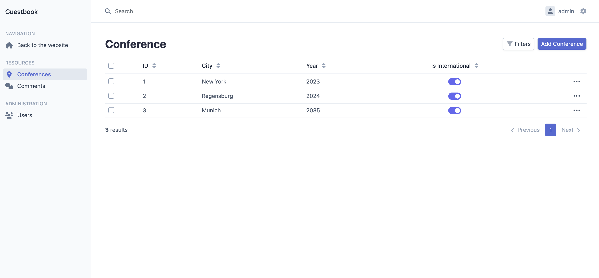
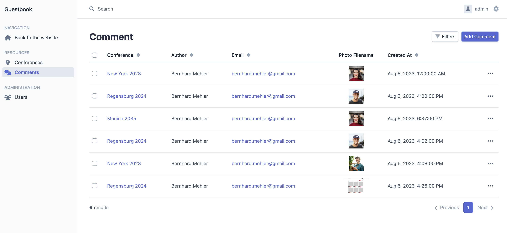

# Symfony Easyadmin Application

This Application built an Easyadmin Backend.

### Features

- A Guestbook with Entities Conferences, Comments and Users
- User Authentification for different Roles
- User Administration
- Searching, filtering and pagination for the datasets
- Image upload

## Getting the Project

To install clone the github repository

```php
git clone https://github.com/bmehler/symfony-easyadmin-app.git
```

Change to the cloned folder and use the composer

```php
cd symfony-easyadmin-app
composer install
```

## To do in Symfony

Change the following line in .env to use a database

```php
DATABASE_URL="mysql://<db_user>:<db_password>@127.0.0.1:3306/<database name>?serverVersion=<e.g. 5.7>&charset= e.g. utf8mb4"

For example:
db_user = your_database_user
db_password = your_database_password
db_host = e.g. 127.0.0.1:3306
db_name = your_database_name
```
Do following to work to connect your database an create a table

```php
php bin/console doctrine:database:create
php bin/console make:migration
php bin/console doctrine:migrations:migrate
```

You can create a virtualhost like I do
```php
<VirtualHost *:80>
    DocumentRoot ".../public/"
    ServerName e.g. symfony-guestbook.local.com
    <Directory ".../public/">
        AllowOverride All
        Order Allow,Deny
        Allow from All
    </Directory>
</VirtualHost>
```

Access the login screen
```php
http://e.g. symfony-guestbook.local.com/login
```

### Screenshot - Conferences




### Screenshot - Comments


